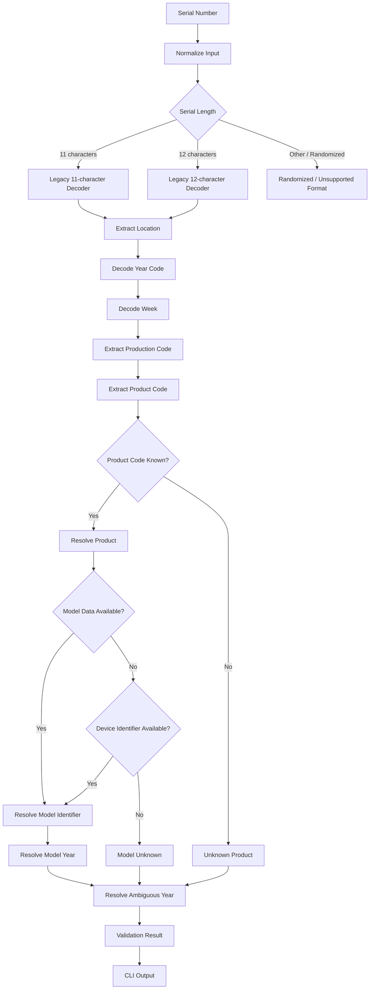
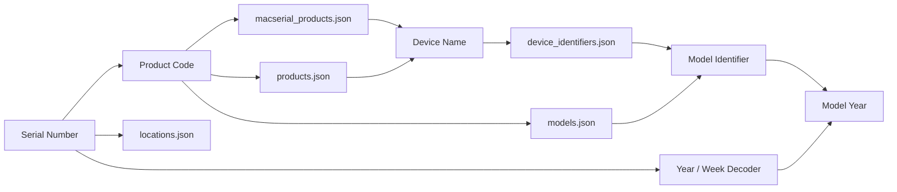

# LegacyInspector

LegacyInspector is a CLI tool for inspecting and decoding legacy Apple serial numbers.

The project focuses primarily on Apple's legacy serial number formats, including the legacy 11-character and 12-character formats used by older Apple hardware.

LegacyInspector decodes the structural components of a serial number, identifies the associated Apple product when possible, resolves production year information, and attempts to determine the corresponding model identifier and model year.

The project is designed to provide useful device identification from the serial number itself without requiring access to Apple's online coverage services.

---

## Features

LegacyInspector currently provides the following capabilities:

* Detect legacy 11-character serial numbers
* Detect legacy 12-character serial numbers
* Detect randomized serial numbers
* Validate serial number structure
* Decode manufacturing location codes
* Decode production year codes
* Decode production week
* Decode production and line identifiers
* Decode product/configuration codes
* Identify Apple products from known product codes
* Resolve model identifiers when model information is available
* Resolve model years when model information is available
* Resolve ambiguous legacy year codes using known device/model information
* Support non-Mac Apple device identifiers where corresponding data is available
* Provide a reason explaining the validation/result
* Maintain separate datasets for product codes and device identifiers
* Import and regenerate datasets from source data

---

## Supported Serial Number Formats

Apple's legacy serial numbers generally use two historical formats:

| Format |        Length | Location | Year   | Week    | Production | Product |
| ------ | ------------: | -------- | ------ | ------- | ---------- | ------- |
| Legacy | 11 characters | 2 chars  | 1 char | 2 chars | 3 chars    | 3 chars |
| Legacy | 12 characters | 3 chars  | 1 char | 1 char  | 3 chars    | 4 chars |

The 11-character format is commonly associated with older Apple hardware.

The 12-character format was introduced later and uses a three-character location prefix and a four-character product code.

LegacyInspector currently focuses on these two formats.

Newer randomized serial numbers are detected but are not decoded using the historical production-code scheme.

> Note: Apple's serial-number formats have changed over time. Some later devices use randomized serial numbers and therefore do not expose the same historical information through the serial number.

---

## Serial Number Structure

### 11-character format

```text
LL Y WW SSS PPP
│  │ │  │   │
│  │ │  │   └── Product code
│  │ │  └────── Production / line identifier
│  │ └───────── Production week
│  └─────────── Production year code
└────────────── Manufacturing location
```

### 12-character format

```text
LLL Y W SSS PPPP
│   │ │ │   │
│   │ │ │   └── Product code
│   │ │ └────── Production / line identifier
│   │ └──────── Production week
│   └────────── Production year code
└────────────── Manufacturing location
```

The product code is particularly useful because it can be mapped to a known Apple product or configuration.

---

## Decoding Pipeline

LegacyInspector processes a serial number through several stages.



The important distinction is that **product identification and model identification are separate datasets**.

A product code may identify a product name even when the model identifier is not directly available from the primary model dataset.

---

## Product and Model Resolution

LegacyInspector uses multiple layers of information when identifying a device.

### Resolution order

```text
Serial Number
     │
     ▼
Product Code
     │
     ▼
macserial product dataset
     │
     ├── Known product
     │
     ▼
Product code → model mapping
     │
     ├── Model found
     │
     ▼
Model Identifier + Model Year
     │
     └── If unavailable
             │
             ▼
      Device Identifier Dataset
             │
             ▼
      Device Name → Identifier
```

This allows the project to handle cases where a product code exists in the historical `macserial` dataset but is not represented directly in the Mac model dataset.

This is particularly useful for older Apple devices such as:

* iPhone
* iPad
* iPod touch
* iPod nano
* iPod shuffle
* Apple TV
* AirPort products
* Mac hardware

---

## Year Resolution

Legacy Apple year codes can be ambiguous because the same encoded year value can represent different production years depending on the generation of the device.

LegacyInspector therefore does not blindly convert a year code into a single calendar year.

Instead, the decoder uses known product/model information when available to determine the most appropriate production year.

Conceptually:

```text
Year Code
    │
    ▼
Possible Calendar Years
    │
    ▼
Known Product
    │
    ▼
Known Model
    │
    ▼
Model Production Years
    │
    ▼
Resolved Production Year
```

This is important for historical serial numbers where a year code can correspond to multiple decades.

The underlying OpenCore `macserial` implementation also uses model information when dealing with ambiguous production-year values.

---

## Example Usage

Run LegacyInspector with a serial number:

```bash
go run ./cmd/legacyinspector SERIAL
```

Example:

```bash
go run ./cmd/legacyinspector C3WF2E79DCP9
```

Example output:

```text
LegacyInspector
================================
Serial         : C3WF2E79DCP9
Format         : Legacy 12-character
Valid          : true
Location Code  : C3W
Location       : Unknown
Year Code      : F
Production Year : 2011
Half           : 1
Week Code      : 2
Week           : 2
Production     : E79
Product Code   : DCP9
Device         : iPod touch (4th generation)
Model Identifier: iPod4,1
Model Year     : 2010
Reason         : Valid Apple legacy 12-character structure. Product recognized.
================================
```

The exact model/year output depends on the datasets available in the repository.

---

## Output Fields

LegacyInspector can report the following information:

| Field              | Description                                         |
| ------------------ | --------------------------------------------------- |
| `Serial`           | Input serial number                                 |
| `Format`           | Detected legacy serial format                       |
| `Valid`            | Whether the serial structure is considered valid    |
| `Location Code`    | Encoded manufacturing location                      |
| `Location`         | Resolved manufacturing location                     |
| `Year Code`        | Encoded production year value                       |
| `Production Year`  | Resolved calendar production year                   |
| `Half`             | Production half associated with the year encoding   |
| `Week Code`        | Encoded production week                             |
| `Week`             | Resolved production week                            |
| `Production`       | Production/line identifier                          |
| `Product Code`     | Apple product/configuration code                    |
| `Device`           | Resolved Apple product name                         |
| `Model Identifier` | Hardware model identifier when available            |
| `Model Year`       | Model year when available                           |
| `Reason`           | Explanation of validation and identification result |

Some fields may be unavailable when the corresponding information is not present in the local datasets.

---

## Data Sources

LegacyInspector uses several local datasets.

### `products.json`

Contains product information used by the decoder.

```text
internal/decoder/data/products.json
```

### `macserial_products.json`

Contains additional Apple product/configuration codes derived from the `macserial` model database.

```text
internal/decoder/data/macserial_products.json
```

The dataset currently contains hundreds of known product codes.

### `models.json`

Contains model mappings generated from the OpenCore/macserial model data.

```text
internal/decoder/data/models.json
```

The current dataset contains thousands of model/product-code entries.

The model data includes information such as:

```json
{
  "name": "Example Apple Product",
  "model": "ExampleModel1,1",
  "model_year": 2012,
  "source": "MODEL.yaml"
}
```

### `device_identifiers.json`

Contains Apple device-name to model-identifier mappings.

```text
internal/decoder/data/device_identifiers.json
```

This dataset is used to resolve devices that may exist in the product dataset but are not represented in `models.json`.

For example, a device name can be resolved to a hardware identifier independently of the Mac-specific model dataset.

### `model_overrides.json`

Contains manually verified model mappings.

```text
internal/decoder/data/model_overrides.json
```

### `overrides.json`

Contains manually maintained product overrides.

```text
internal/decoder/data/overrides.json
```

### `locations.json`

Contains legacy manufacturing-location mappings.

```text
internal/decoder/data/locations.json
```

---

## Dataset Relationship

The datasets are intentionally separated by responsibility.



This separation avoids forcing every Apple device into the Mac-specific model dataset.

---

## Current Dataset Coverage

The repository currently contains approximately:

| Dataset                   | Entries |
| ------------------------- | ------: |
| `macserial_products.json` |     502 |
| `models.json`             |   3,548 |
| `device_identifiers.json` |     333 |

The numbers may change as the datasets are regenerated or expanded.

The product dataset and model dataset do not have a one-to-one relationship.

For example, a product code may exist in `macserial_products.json` while its model identifier is resolved through `device_identifiers.json` instead of `models.json`.

---

## Model Resolution Strategy

LegacyInspector uses product-code information first whenever possible.

A simplified resolution strategy is:

```text
1. Decode serial number
        │
        ▼
2. Extract product code
        │
        ▼
3. Look up product code
        │
        ├── Not found → Product Unknown
        │
        ▼
4. Resolve product/device name
        │
        ▼
5. Look up product code in models.json
        │
        ├── Found → Model Identifier
        │
        ▼
6. If not found, use device_identifiers.json
        │
        ├── Found → Model Identifier
        │
        └── Not found → Model Identifier Unknown
```

This strategy allows the project to support both Mac and non-Mac Apple hardware without requiring all devices to exist in the same source dataset.

---

## Unknown Results

A valid serial number does not necessarily mean that every field can be resolved.

For example:

```text
Valid          : true
Device         : Some Apple Device
Model Identifier: Unknown
```

can be a legitimate result.

Possible reasons include:

* The product code is valid but not present in the local dataset.
* The product name exists but no device identifier is available.
* The corresponding model is not included in the current OpenCore model dataset.
* The serial belongs to hardware outside the currently covered dataset.
* Historical Apple product information is incomplete or inconsistent between sources.

LegacyInspector therefore separates:

```text
Serial validity
```

from:

```text
Product identification
```

and:

```text
Model identification
```

A serial can be structurally valid even when the device/model cannot be completely identified.

---

## Randomized Serial Numbers

Modern Apple hardware increasingly uses randomized serial numbers.

These serial numbers do not follow the historical product-code structure documented for legacy serials.

LegacyInspector detects unsupported/randomized formats but does not attempt to derive historical manufacturing information from them.

```text
Legacy Serial
     │
     ├── 11 characters → Decode
     │
     └── 12 characters → Decode

Randomized / unsupported
     │
     └── Detect only
```

---

## Project Structure

```text
LegacyInspector/
│
├── cmd/
│   └── legacyinspector/
│       └── main.go
│
├── internal/
│   └── decoder/
│       │
│       ├── data/
│       │   ├── device_identifiers.json
│       │   ├── locations.json
│       │   ├── macserial_products.json
│       │   ├── model_overrides.json
│       │   ├── models.json
│       │   ├── overrides.json
│       │   └── products.json
│       │
│       ├── data_loader.go
│       ├── decoder.go
│       ├── device_identifier_loader.go
│       ├── location.go
│       ├── location_loader.go
│       ├── model_loader.go
│       ├── product.go
│       ├── product_loader.go
│       ├── validator.go
│       └── validator_test.go
│
├── tools/
│   │
│   ├── import_device_identifiers/
│   │   ├── main.go
│   │   └── ...
│   │
│   ├── import_locations/
│   │
│   ├── import_macserials/
│   │
│   ├── import_models/
│   │   └── OpenCorePkg/
│   │
│   └── import_products/
│
├── .gitignore
├── go.mod
└── README.md
```

The external Apple device-identifier source used during development is intentionally excluded from Git.

Likewise, the OpenCore source used to generate model information is not required to be committed to this repository.

---

## Data Import Tools

The project contains tools for generating and importing datasets.

### Import models

```bash
go run ./tools/import_models
```

The OpenCore source must be available locally under:

```text
tools/import_models/OpenCorePkg/
```

This source directory is intentionally excluded from Git.

### Import products

```bash
go run ./tools/import_products
```

### Import locations

```bash
go run ./tools/import_locations
```

### Import device identifiers

```bash
go run ./tools/import_device_identifiers
```

The device identifier importer is responsible for converting the external device identifier source into the repository's local:

```text
internal/decoder/data/device_identifiers.json
```

The external source itself should remain excluded from the repository.

---

## Development

Format the Go source:

```bash
gofmt -w .
```

Run the test suite:

```bash
go test ./...
```

Run static analysis:

```bash
go vet ./...
```

Build the CLI:

```bash
go build ./cmd/legacyinspector
```

Run the application:

```bash
go run ./cmd/legacyinspector SERIAL
```

A complete development verification can therefore be performed with:

```bash
gofmt -w internal/decoder/*.go
go test ./...
go vet ./...
go build ./cmd/legacyinspector
```

---

## Testing

The project includes regression tests for legacy serial decoding and validation.

Run all tests with:

```bash
go test ./...
```

The expected output should contain successful results for the decoder package.

Example:

```text
ok      legacyinspector/internal/decoder
```

The project also uses real historical serial examples in its regression tests to ensure that changes to product/model resolution do not break existing decoding behavior.

---

## Validation Philosophy

LegacyInspector treats serial validation and device identification as separate operations.

A serial number can be:

### Structurally valid

The serial follows a recognized Apple legacy structure.

```text
Valid : true
```

### Structurally valid but unidentified

The serial structure is valid, but the product/model dataset does not contain enough information.

```text
Valid           : true
Device          : Unknown
Model Identifier: Unknown
```

### Recognized

The serial structure is valid and the product code is known.

```text
Valid  : true
Device : Known Apple Product
```

### Fully resolved

The serial structure, product, model identifier, and model year can all be resolved.

```text
Valid           : true
Device          : Known Apple Product
Model Identifier: KnownModel1,1
Model Year      : YYYY
```

This distinction is important because the absence of model information should not automatically cause an otherwise valid legacy serial to be classified as invalid.

---

## Relationship With OpenCore `macserial`

LegacyInspector uses OpenCore's `macserial` data as an important source of historical Apple model/product information.

OpenCore's `macserial` implementation contains Apple model tables, model codes, production years, product descriptions, and serial parsing logic.

The original OpenCore documentation describes the legacy 11-character and 12-character serial layouts and explains how product codes are associated with Apple hardware.

LegacyInspector does not simply expose the original `macserial` output. Instead, the project imports relevant data into local JSON datasets and implements its own Go-based decoding and resolution layer.

This provides:

* A standalone Go CLI
* Local deterministic datasets
* Easier testing
* Separation between serial decoding and model resolution
* Support for additional device-identifier data
* Easier maintenance of manual overrides

---

## Design Goals

The project aims to keep the decoder:

### Deterministic

The same serial number and same dataset should produce the same result.

### Offline

Device identification should not require a live Apple API or coverage lookup.

### Extensible

New product codes, model identifiers, and locations can be added without rewriting the decoder.

### Dataset-driven

Historical Apple information should live in data files rather than being hard-coded throughout the decoder.

### Testable

Changes to decoding and model resolution should be covered by regression tests.

### Conservative

The decoder should distinguish between:

* known information
* inferred information
* unavailable information

rather than inventing a model when the dataset does not support one.

---

## Limitations

LegacyInspector has several known limitations.

### Randomized serial numbers

Randomized serial numbers cannot be decoded using the historical production-code method.

### Incomplete historical data

Apple's historical product/configuration datasets are not fully standardized or publicly documented.

Some valid product codes may therefore have incomplete metadata.

### Model identifier coverage

The Mac model dataset and the broader Apple device identifier dataset cover different classes of devices.

Consequently, some devices may have a recognized product name without a corresponding model identifier.

### Manufacturing locations

Some historical location codes are unknown or cannot be confidently mapped to a manufacturing facility.

In such cases:

```text
Location : Unknown
```

does not mean that the serial number itself is invalid.

---

## Roadmap

Potential future improvements include:

* Expand historical product-code coverage
* Expand device identifier coverage
* Improve manufacturing-location coverage
* Add more regression cases
* Improve model-year disambiguation
* Add structured JSON output
* Add machine-readable output modes
* Add batch serial-number processing
* Add optional CSV input/output
* Improve randomized serial detection
* Add more detailed validation diagnostics
* Improve documentation of historical Apple serial formats

---

## Status

LegacyInspector is under active development.

The current implementation supports:

* Legacy 11-character serial detection
* Legacy 12-character serial detection
* Serial validation
* Production year decoding
* Production week decoding
* Production/line code decoding
* Product-code identification
* Manufacturing-location lookup
* Product-to-model resolution
* Device-name-to-model-identifier fallback resolution
* Model-year resolution when available
* Randomized serial detection

The primary focus is improving the reliability and coverage of the historical Apple product and model datasets while keeping the decoder itself simple and maintainable.

---

## License and Source Data

LegacyInspector's own source code and generated datasets are maintained separately from external source repositories.

External datasets and source repositories may have their own licenses and attribution requirements.

The OpenCore source used for model-data generation is maintained by the OpenCore project.

When updating imported datasets, preserve the licensing and attribution information of the original source.

---

## Quick Start

Clone the repository:

```bash
git clone https://github.com/malikalamsyah99/LegacyInspector.git
cd LegacyInspector
```

Run tests:

```bash
go test ./...
```

Run static analysis:

```bash
go vet ./...
```

Build:

```bash
go build ./cmd/legacyinspector
```

Run:

```bash
go run ./cmd/legacyinspector SERIAL
```

Or execute the compiled binary:

```bash
./legacyinspector SERIAL
```

---

## Summary

LegacyInspector is a local, dataset-driven Apple legacy serial-number decoder.

Its architecture separates the problem into several layers:

```text
                 ┌─────────────────────┐
                 │    Serial Number    │
                 └──────────┬──────────┘
                            │
                            ▼
                 ┌─────────────────────┐
                 │ Format / Validation │
                 └──────────┬──────────┘
                            │
                            ▼
                 ┌─────────────────────┐
                 │ Location / Year /   │
                 │ Week / Product Code│
                 └──────────┬──────────┘
                            │
                            ▼
                 ┌─────────────────────┐
                 │  Product Resolution │
                 └──────────┬──────────┘
                            │
                 ┌──────────┴──────────┐
                 │                     │
                 ▼                     ▼
        ┌────────────────┐    ┌────────────────────┐
        │   models.json  │    │device_identifiers  │
        │                │    │      .json         │
        └───────┬────────┘    └──────────┬─────────┘
                │                        │
                └──────────┬─────────────┘
                           ▼
                 ┌─────────────────────┐
                 │ Model Identifier    │
                 │ + Model Year        │
                 └──────────┬──────────┘
                            │
                            ▼
                 ┌─────────────────────┐
                 │    CLI Result       │
                 └─────────────────────┘
```

The goal is not simply to determine whether a serial number "looks valid", but to progressively extract and resolve as much reliable historical Apple hardware information as the available datasets support.
